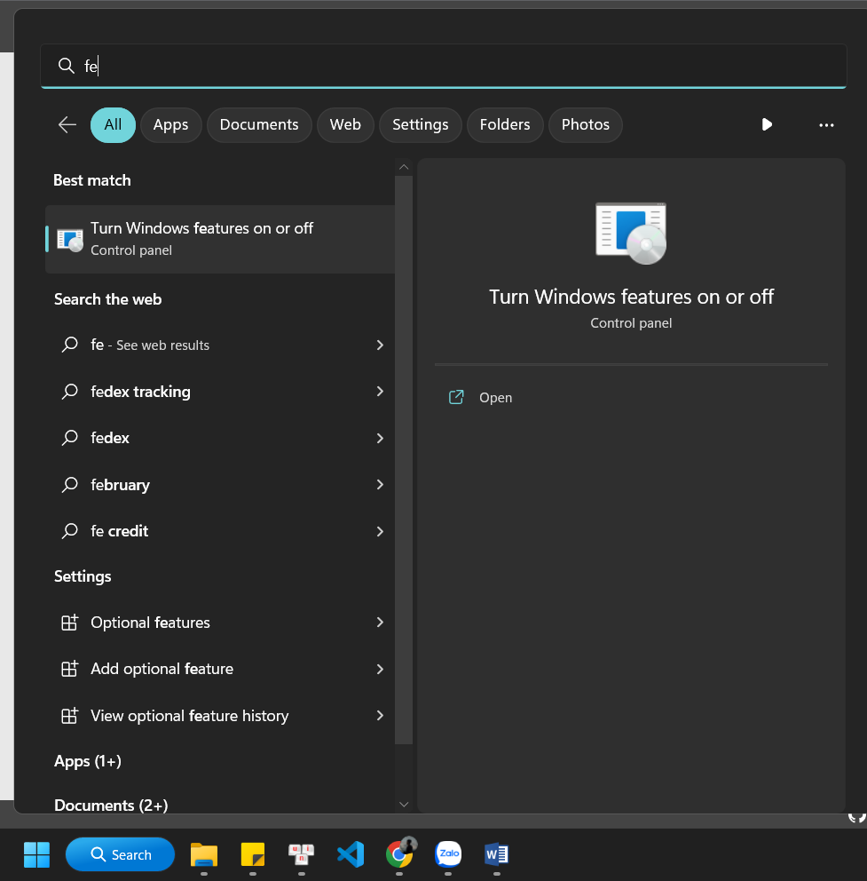
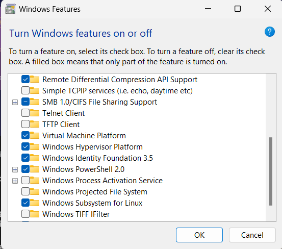

# Thông tin phiên bản mình cài
#### WSL 1
#### Ubuntu-22.04
#### Zeppelin 0.8.2

# Cách cài đặt WSL
## Bước 1: Bật tính năng Windows Subsystem for Linux và các tính năng hỗ trợ khác
### 1. Vào thanh Search của Windows tìm Turn Windows features on or off


### 2.  Tìm vào tick vào 3 ô
    - Virtual Machine Platform
    - Windows Hypervisor Platform
    - Windows Subsystem for Linux


### 3. Khởi động lại máy tính
## Bước 2: Cài đặt Ubuntu cho WSL
### 1. Xem bản phân phối có sẵn cho WSL
#### Mở PowerShell gõ
```wsl --list --online```


### 2. Cài đặt Ubuntu
```wsl --install -d Ubuntu-22.04```
#### Trong đó Ubuntu-22.04 là tên bản phân phối
#### Đợi quá trình cài đặt hoàn tất
### 3. Thiết lập thông tin
#### nhập username
#### nhập password
### 4. Kiểm tra cài đặt
#### Mở PowerShell gõ
```wsl```


# Cách cài đặt zeppelin trên WSL
## Bước 1: Cài đặt Open JDK trên WSL
### 1. Mở terminal WSL và chạy dòng lệnh sau để update apt
```sudo apt update```
### 2. Kiểm tra Java đã cài đặt trên WSL hay chưa
```java --version```
#### Nếu Java chưa cài đặt thì output là yet: -bash: java: command not found.
### 3. Cài đặt OpenJDK
```sudo apt-get install openjdk-8-jdk```
#### Nhập Y nếu được hỏi
#### Chờ quá trình cài đặt xong
### 4. Kiểm tra Java đã cài thành công
```java --version```


#### Như vậy là thành công rồi nhé
## Bước 2: Cài đặt Zeppelin
### 1. Mở terminal WSL vầ tải gói zeppelin về WSL
```sudo wget https://dlcdn.apache.org/zeppelin/zeppelin-0.8.2/zeppelin-0.8.2-bin-all.tgz```
#### Trong link trong câu lệnh trên bạn có thể lên trang chủ lấy về
#### Đợi quá trình cài đặt xong
### 2. Giải nén ở đây gói zeppelin (ở đây mình sẽ giải nén ở thư mục home/username)
```tar -xvzf zeppelin-0.8.2-bin-all.tgz -C ~```
## Bước 3: Chạy thử Zeppelin 
### 1. Chuyển vào thư mục home/username bằng lệnh
```cd```
### 2. Chuyển vào thư mục Zeppelin 
```cd zeppelin-0.8.2-bin-all/```
### 3. Khởi chạy Zeppelin
```sudo bin/zeppelin-daemon.sh start```
### 4. Mở trình duyệt và nhập localhost:8080
### 5. Dừng Zeppelin
```sudo bin/zeppelin-daemon.sh stop```
